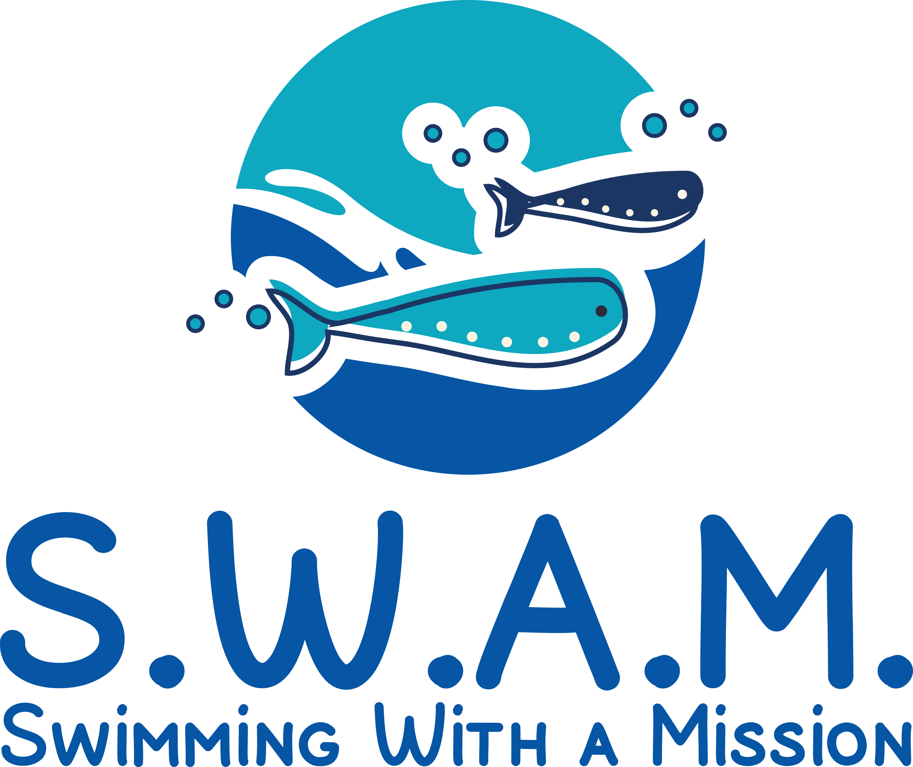
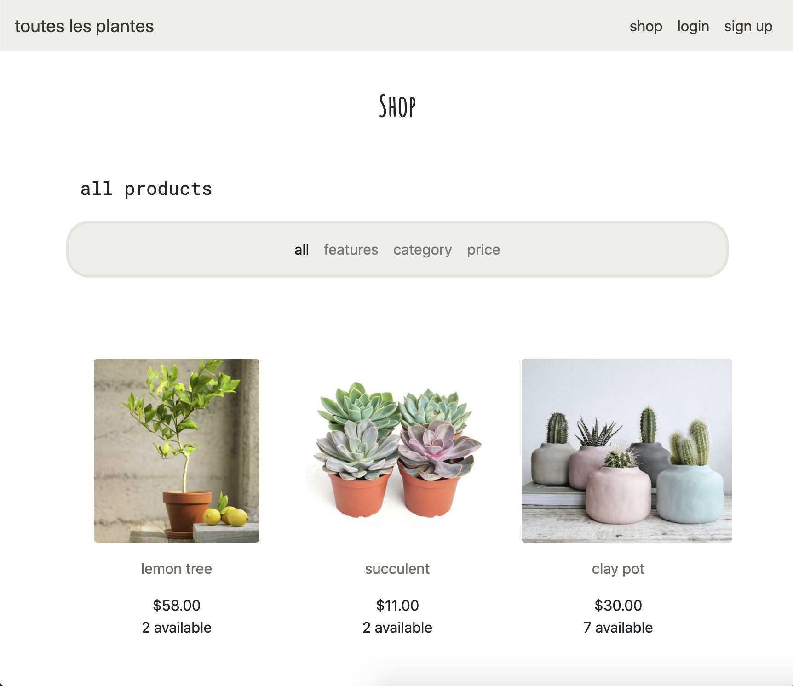
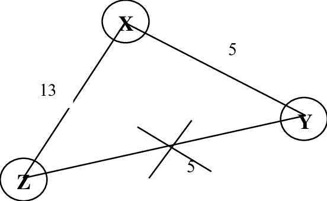

<!DOCTYPE html>
<html lang="en">

<head>
    <meta charset="UTF-8">
    <link rel="icon" href="static/img/kf-logo.png" type="image/png">
    <meta charset="UTF-8">
    <meta name="viewport" content="width=device-width, initial-scale=1, shrink-to-fit=no">
    <link rel="stylesheet" href="https://stackpath.bootstrapcdn.com/bootstrap/4.4.1/css/bootstrap.min.css"
          integrity="sha384-Vkoo8x4CGsO3+Hhxv8T/Q5PaXtkKtu6ug5TOeNV6gBiFeWPGFN9MuhOf23Q9Ifjh" crossorigin="anonymous">
    <link href="https://fonts.googleapis.com/css2?family=Nunito:wght@300&display=swap" rel="stylesheet">
    <link rel="stylesheet" href="https://cdnjs.cloudflare.com/ajax/libs/font-awesome/4.7.0/css/font-awesome.min.css">
    <link rel="stylesheet" href="static/style.css">
    
    
    

    <title>Kelly Finnerty</title>
</head>

<body>
    <nav class="navbar sticky-top navbar-expand-md navbar-light bg-light">
        <button class="navbar-toggler" type="button" data-toggle="collapse" data-target="#navbarSupportedContent"
                aria-controls="navbarSupportedContent" aria-expanded="false" aria-label="Toggle navigation">
            
        </button>

        

            <ul class="navbar-nav mr-auto">
                <li class="nav-item active">
                    <a class="nav-link" href="#">Home(current)</a>
                </li>
                <li class="nav-item">
                    <a class="nav-link" href="#projects">Projects</a>
                </li>
                <li class="nav-item">
                    <a class="nav-link" href="#resume-contact">Resume</a>
                </li>
                <li class="nav-item">
                    <a class="nav-link" href="#resume-contact">Contact</a>
                </li>
            </ul>
        

    </nav>

    

        <header>
            

                

                    
                

                

                    <h1>
                        Kelly Finnerty
                        <a href="https://www.linkedin.com/in/kelly-finnerty-04538b14a/" target="_blank" data-toggle="tooltip" title="LinkedIn">
                            <i class="fab fa-linkedin link-icon socials-icons" alt="link to linkedin"></i>
                        </a>
                        <a href="https://github.com/kellyfinnerty" target="_blank" data-toggle="tooltip" title="Github">
                            <i class="fab fa-github-square link-icon socials-icons" alt="github link"></i>
                        </a>

                    </h1>
                    
Computer Science, B.A. | McGill University 2016-2020

                    
<i id="map-pin" class="fas fa-map-pin"></i>
                        Boston, MA

                

            

        </header>
        <section id="about">
            

                

                    <h2>About Me</h2>
                    
Lorem ipsum dolor sit amet, consectetur adipiscing elit, sed do eiusmod tempor incididunt ut labore et dolore magna aliqua.
                        Lacus laoreet non curabitur gravida. Natoque penatibus et magnis dis parturient montes nascetur. Ut aliquam purus sit amet
                        luctus venenatis lectus. Nunc mi ipsum faucibus vitae aliquet nec ullamcorper sit. In fermentum et sollicitudin ac orci
                        phasellus. Ipsum faucibus vitae aliquet nec ullamcorper sit. Interdum posuere lorem ipsum dolor. Arcu felis bibendum ut
                        tristique et egestas quis ipsum. Lacus viverra vitae congue eu consequat ac. Sit amet est placerat in egestas erat imperdiet.
                        Pulvinar sapien et ligula ullamcorper. Faucibus ornare suspendisse sed nisi lacus. Egestas quis ipsum suspendisse ultrices.
                        Commodo elit at imperdiet dui accumsan sit amet nulla. Id nibh tortor id aliquet lectus proin nibh nisl condimentum.
                        Eget velit aliquet sagittis id consectetur purus.
                    

                

            

        </section>

        

            

                <h3>Resume
                <a href="static/files/Kelly_Finnerty_CV.pdf" download data-toggle="tooltip" title="Download">
                    <i id="download-icon" alt="download button" class="fas fa-download link-icon fa-xs"></i>
                </a></h3>
            

            

                <h3>Contact</h3>
                

                    <a href="mailto:kfinnerty01@gmail.com" id="email">
                        <i alt='envelope' class="far fa-envelope contact-icon"></i>
                        kfinnerty01@gmail.com
                    </a>
                

                

                    <i class="fas fa-phone contact-icon"></i>
                    (978)-826-3929
                

            

        

        <section id="projects">
            

                

                

                    <h2 id="project-header">Projects I've Worked On</h2>
                

                

                    
                    <h3>Database for a Student Club</h3>
                    

                        In a team, created a database for SWAM, a McGill clubs where volunteers teach disabled children inexpensive swim lessons.
                        We designed the database using an ER diagram and translated it to PostgreSQL to add data and make useful queries.
                        Created a user interface.
                    

                

                

                    
                    <h3>Ecommerce Website</h3>
                    

                        Created a plant (craigslist-style) website where users can upload plants, add them to their cart, and discuss products with sellers.
                        Created using Django, Bootstrap and more. Worked on ordering, order history, and websocket communication.
                    

                

                

                    
                    <h3>Link State Routing</h3>
                    
In group of two, created a link state routing environment using Java.
                        In terminal, can run routers and initiate connections between them to create a network.
                        They can find the shortest path to another node. They can disconnect and leave the network.
                    

                

            

        </section>

        

            

                <footer>Created by Me | 2020</footer>
            

        

    

    
    
    
</body>

</html>

